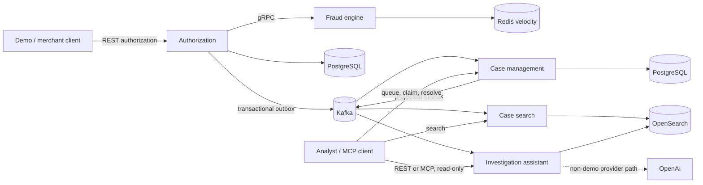

# TransactIQ

TransactIQ is a public portfolio implementation of a real-time transaction-intelligence flow:
authorize a synthetic payment, assess fraud, create and investigate a case, project it to search,
and produce a citation-grounded advisory answer. It demonstrates service boundaries, reliable
events, idempotency, safe AI integration, and a deployment blueprint—not a production payment
processor. Every identifier and transaction in the repository is synthetic.

## One-minute architecture



The merchant path is synchronous through fraud assessment and durable authorization completion.
Kafka is downstream: at-least-once events create a case and update independent read projections.
PostgreSQL remains authoritative; OpenSearch is eventually consistent. AI retrieval and answers
are advisory and cannot mutate a case.

## What is implemented

| Cycle | Portfolio increment |
|---|---|
| 1 | Business contracts, authorization boundaries, and Gradle multi-module foundation |
| 2 | Deterministic authorization policy and validated HTTP vertical slice |
| 3 | PostgreSQL ledger, balance reservations, request idempotency, and atomic completion |
| 4 | gRPC fraud engine, six synthetic rules, Redis velocity, transactional Kafka outbox, and simulator |
| 5 | Idempotent case creation, recovery/DLT behavior, analyst lifecycle, projection outbox, and search |
| 6 | Safe evidence indexing, hybrid retrieval, grounded answers, and two real read-only MCP tools |
| 7-lite | GCP/Terraform blueprint, keyless CI/CD, container validation, health, metrics, and structured logs |
| 8 | Reproducible local walkthrough, offline AI isolation, performance smoke, portfolio docs, and threat model |

**Stack:** Java 21, Kotlin, Spring Boot, Spring AI, Gradle, REST, gRPC/Protobuf, Kafka,
PostgreSQL/Liquibase, Redis, OpenSearch, Docker Compose, JUnit/Testcontainers, Micrometer,
Terraform/GCP, GitHub Actions/OIDC, and k6.

## Run the deterministic demo

Prerequisites are Java 21, Docker Desktop with Compose, and PowerShell 7 or Windows PowerShell 5.1.
From a clean checkout, run:

```powershell
.\scripts\demo\run-demo.ps1
```

A thin Bash launcher is available where PowerShell 7 is installed:

```bash
bash ./scripts/demo/run-demo.sh
```

The command uses bounded readiness polling, creates unique synthetic IDs, and retains Docker
volumes by default. It exercises CLEAR, REVIEW, and blocking `HIGH_RISK` outcomes; follows one
fraud case through queue, detail, claim, resolution, and search; performs evidence retrieval and a
grounded answer; then lists and calls both MCP tools. Its explicit `demo-offline` profile uses
deterministic local embeddings and generation and cannot contact OpenAI.

Start with the [demo walkthrough](docs/portfolio/demo-walkthrough.md) for expected checkpoints,
what to inspect, and troubleshooting. The [transaction simulator](docs/testing/transaction-simulator.md)
remains available for focused authorization scenarios, and the
[k6 smoke guide](performance/k6/README.md) describes short, configurable local traffic.
Local smoke numbers are not production benchmarks.

## Interfaces and reliability boundaries

- **REST authorization:** `POST /api/v1/authorizations`; returns the durable decision and supports
  exact-request idempotency.
- **gRPC fraud:** `transactiq.fraud.v1.FraudAssessmentService/Assess`; returns `CLEAR`, `REVIEW`, or
  `HIGH_RISK` plus internal synthetic scoring evidence.
- **Kafka:** `transactiq.authorization.completed.v1` carries completed facts; the compacted
  `transactiq.fraud-case.projection.v1` carries full case snapshots. Both pipelines validate,
  deduplicate, and use controlled retry/DLT behavior.
- **Case REST:** `/api/v1/fraud-cases` provides queue/detail/history plus optimistic claim and
  resolution commands. `X-Analyst-Id` is a development identity, not authentication.
- **Search REST:** `GET /api/v1/fraud-cases/search` queries an eventually consistent OpenSearch
  projection with filters, stable sorting, and opaque cursors.
- **Investigation REST:** retrieval and grounded answers are under
  `/api/v1/fraud-cases/{caseId}/investigation`. Every factual finding requires an allowed citation.
- **MCP:** synchronous Streamable HTTP at `/mcp` exposes exactly
  `retrieve_fraud_case_evidence` and `answer_fraud_investigation_question`; both are read-only and
  reuse the REST application services.

Detailed contracts live in [business documentation](docs/business). The three most consequential
design choices are indexed in [architecture decisions](docs/architecture/README.md).

## Engineering evidence

- **Tests:** domain/unit tests, HTTP and gRPC integration tests, Kafka/PostgreSQL/OpenSearch
  Testcontainers, protocol-level MCP tests, offline AI evaluations, observability tests, and the
  deterministic end-to-end demo.
- **CI/CD:** pull requests and `main` run the Java 21 build, five Docker builds, and Terraform
  validation. Manual deployment uses GitHub OIDC/Workload Identity Federation, immutable commit
  SHA image tags, a saved plan, and protected-environment approval before apply.
- **GCP blueprint:** Artifact Registry, five Cloud Run services with dedicated identities, private
  networking, Cloud SQL, Memorystore, Secret Manager containers, probes, and Cloud Run alerts.
  Kafka and OpenSearch are honest external managed-service inputs.
- **Observability:** liveness/readiness, safe Prometheus exposure, JSON logs, UUID request
  correlation, and fixed low-cardinality authorization, fraud, case, and investigation metrics.
- **Security:** synthetic fixtures only; raw card tokens, evidence, analyst questions, prompts,
  provider payloads, credentials, and integrity markers are excluded from logs and public DTOs.
  Evidence is untrusted data, generated citations are allow-listed server-side, and AI/MCP has no
  mutation port. See the [threat model](docs/security/threat-model.md).

## Build and validate

```powershell
.\gradlew.bat build --console=plain
docker compose config --quiet
terraform fmt -check -recursive infra
terraform -chdir=infra/environments/dev init -backend=false -input=false
terraform -chdir=infra/environments/dev validate
git diff --check
```

See the [GCP deployment blueprint](docs/operations/gcp-deployment-blueprint.md) for Docker image
validation, configuration, observability, cost-conscious defaults, and deployment prerequisites.
No infrastructure is deployed by the local demo or CI validation workflow.

## Deliberate limitations

This portfolio has no UI, gateway authentication/authorization, PCI scope, real cards or people,
production fraud model, settlement/clearing, conversation memory, autonomous decisions, or case
reopen/reassignment. Local endpoints and `X-Analyst-Id` are unauthenticated. Kafka and OpenSearch
are single-node local dependencies and external managed-service assumptions in GCP; OpenSearch
authentication remains integration work. Search and investigation projections are eventually
consistent. The GCP design is single-region, cost-conscious dev infrastructure—not HA/DR—and has
not been applied. Production use requires the controls and decisions listed in the
[threat model](docs/security/threat-model.md#accepted-risks-before-production).
