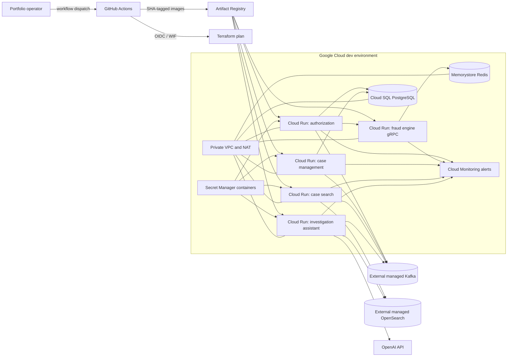

# GCP deployment blueprint (Cycle 7-lite)

## Scope

This is a dev-oriented deployment blueprint, not a deployed environment. Terraform describes the
Google Cloud resources, GitHub Actions validates and can manually plan them, and application images
are tagged with a Git commit SHA. The repository contains no project ID, credential, secret value,
Terraform state, or automatic deployment trigger.

Kafka and OpenSearch remain external managed-service dependencies. Terraform accepts their
endpoints and configures clients; it does not claim to provision either product.

## Deployment model



## Runtime mapping

| Module | Cloud runtime | Dependencies | Background-runtime setting |
|---|---|---|---|
| `authorization-service` | Cloud Run HTTP service | Authorization Cloud SQL database, fraud-engine gRPC, external Kafka, DB and Kafka secrets | One minimum instance and continuously allocated CPU for the outbox relay |
| `fraud-engine` | Cloud Run native gRPC/h2c on port 8080; Actuator on internal port 8081 | Private Memorystore Redis | Request-based CPU and zero minimum instances |
| `case-management-service` | Cloud Run HTTP service | Case-management Cloud SQL database, external Kafka, DB and Kafka secrets | One minimum instance and continuously allocated CPU for Kafka consumption and projection relay |
| `case-search-service` | Cloud Run HTTP service | External Kafka and external OpenSearch | One minimum instance and continuously allocated CPU for Kafka indexing |
| `investigation-assistant-service` | Cloud Run HTTP/MCP service | External Kafka, external OpenSearch, OpenAI API key | One minimum instance and continuously allocated CPU for evidence indexing |
| `transaction-simulator` | Local CLI only | Authorization HTTP endpoint | Not deployed by this blueprint |
| Contract modules | Build-time libraries only | Their consuming services | Not deployable images |

All Cloud Run revisions use dedicated runtime service accounts, direct VPC egress, bounded scaling,
startup and liveness probes, and immutable Artifact Registry tags. HTTP services use Actuator probe
paths on port 8080; the fraud engine uses TCP probes on its declared h2c/gRPC port because Cloud Run
cannot probe its separate, undeclared Actuator management port. The fraud engine uses internal
ingress and h2c. Its Invoker IAM check is disabled only because the current gRPC client cannot attach
a Cloud Run identity token; all traffic from authorization is forced through the VPC so the service
remains an internal network endpoint.

## Terraform structure and lifecycle

- `infra/modules/cloud-run-service` holds the one reusable resource module that removes repetition
  across the five Cloud Run services.
- `infra/environments/dev` owns APIs, Artifact Registry, runtime identities, private networking,
  Cloud SQL, Memorystore, Secret Manager containers, Cloud Run services, alerts, and outputs.
- The empty GCS backend block contains no bucket identifier. The manual workflow supplies the
  pre-created state bucket and `transactiq/dev` prefix.
- `deploy_services=false` is the safe default. A foundation apply can create shared resources and
  empty secret containers without trying to start an unusable revision.
- After operators create database roles, add secret versions, and make external dependencies
  reachable, `deploy_services=true` enables the five services.
- Stateful resources and Cloud Run services use deletion protection by default. Dev teardown
  requires an explicit configuration change first.

Useful outputs include the Artifact Registry URL, expected immutable image references, Cloud Run
URIs, runtime service-account emails, Secret Manager container IDs, Cloud SQL connection metadata,
the Memorystore endpoint, and the VPC ID.

No database password is passed to a `google_sql_user` resource and no secret version is managed by
Terraform, because either choice would retain secret material in state.

## CI/CD

`.github/workflows/ci.yml` runs for pull requests and pushes to `main`. It provides:

- Java 21 and the Gradle Wrapper with Gradle build caching;
- the complete Gradle build and test suite;
- a five-service Docker Buildx matrix that builds but never publishes images; and
- Terraform formatting, backend-disabled initialization, and validation.

`.github/workflows/deploy-dev.yml` is manual and restricted to `main`. It uses GitHub OIDC and a
pre-created Workload Identity Federation provider; service-account JSON keys are not accepted.
Every run creates a Terraform plan first. Selecting `apply` adds a second job protected by the
`transactiq-dev` GitHub environment, where required reviewers must explicitly approve execution.

The workflow has two scopes:

1. `foundation` uses `deploy_services=false`, skips image publication, and can create the registry,
   network, data services, identities, and empty secret containers. It is a bootstrap scope: after
   service modules enter the shared state, a guard rejects it so it cannot propose their removal.
2. `services` validates all five images, plans with the current 40-character commit SHA, and only
   after environment approval publishes those immutable tags and applies the saved plan.

The workflow fails before authentication when required repository variables are absent.

## Configuration and secrets

Configure these GitHub repository variables deliberately:

| Variable | Purpose |
|---|---|
| `GCP_PROJECT_ID` | Target project; never committed |
| `GCP_REGION` | Regional resource location |
| `GCP_ARTIFACT_REGISTRY_REPOSITORY` | Docker repository ID |
| `GCP_WORKLOAD_IDENTITY_PROVIDER` | Full pre-created WIF provider resource name |
| `GCP_DEPLOY_SERVICE_ACCOUNT` | Keyless deployer service-account email |
| `GCP_TERRAFORM_STATE_BUCKET` | Pre-created GCS state bucket |
| `TRANSACTIQ_KAFKA_BOOTSTRAP_SERVERS` | External managed Kafka endpoints, without credentials |
| `TRANSACTIQ_OPENSEARCH_URL` | External HTTPS OpenSearch endpoint, without credentials |

Terraform creates empty containers for the authorization DB password, case-management DB
password, Kafka SASL JAAS configuration, and OpenAI API key. Operators add versions outside
Terraform. Secret-level IAM grants each runtime identity access only to the values it needs.

The Kafka clients default to `SASL_SSL` with a secret JAAS configuration; `SSL` and supported SCRAM
mechanisms can be selected with Terraform variables. Provider-specific CA/client-certificate setup
is not generalized. The current OpenSearch adapters accept an HTTPS URL but no authentication
credential, so the dev blueprint requires a privately reachable or network-allowlisted endpoint.

## Observability

Each HTTP application exposes only:

- `/actuator/health`, `/actuator/health/liveness`, and `/actuator/health/readiness`;
- `/livez` and `/readyz` as probe aliases on HTTP services;
- `/actuator/info`; and
- `/actuator/prometheus`.

Health details are never returned. The fraud engine runs the same Spring Boot endpoints on its
process-internal management port while Cloud Run routes and TCP-probes gRPC on port 8080. Console
logs default to Spring Boot's JSON Logstash format, which Cloud Logging can ingest as structured
JSON. Set `TRANSACTIQ_LOG_FORMAT` only when a different local format is deliberately required.

The shared servlet filter accepts `X-Request-Id` only when it is a canonical UUID; all other
untrusted header content is discarded and replaced with a generated UUID. It places only that
value in MDC for the request and returns it in the response header; it never reads or logs request
bodies.

Bounded business counters are:

| Meter | Fixed tags |
|---|---|
| `transactiq.authorization.processed` | result and authorization decision |
| `transactiq.fraud.assessed` | assessment or safe technical outcome |
| `transactiq.case.event.processed` | created, already-existing, not-required, or failed processing attempt |
| `transactiq.investigation.processed` | retrieval/answer operation and safe grounding/failure outcome; answer operations also perform retrieval |

IDs, rule codes, payment evidence, analyst questions, AI content, credentials, and integrity fields
are never metric tags. Metric recording fails open so a registry fault cannot change business
processing. Standard JVM/process/HTTP meters are available through Prometheus. The Terraform alert
policies use native Cloud Run metrics scoped to the five TransactIQ services: any sustained 5xx rate
and p95 request latency above two seconds. Notification channel IDs are optional inputs.

This increment does not provision a Prometheus scraper or export custom Micrometer meters into
Cloud Monitoring automatically. `/actuator/prometheus` is for local inspection or a deliberately
configured compatible collector; the included GCP alerts use Cloud Run's platform metrics.

## Prerequisites

Before any manual apply:

1. Create a GCP project with billing and an organization-approved region.
2. Bootstrap a GCS state bucket, GitHub WIF pool/provider, and least-privilege deployer service
   account outside this stack; the stack cannot create the identity used to apply itself.
3. Configure the repository variables above and create the protected `transactiq-dev` GitHub
   environment with required reviewers.
4. Run the `foundation` workflow scope.
5. Create the two PostgreSQL application roles and add the four required secret versions without
   placing values in Git, Terraform variables, workflow logs, or state.
6. Provide reachable external Kafka and OpenSearch services. Configure their private routing,
   allowlists, CA trust, retention, backups, and provider-side credentials directly with the chosen
   vendor.
7. Run the `services` scope as `plan`; inspect it before requesting the protected `apply` job.
8. Grant `roles/run.invoker` only to approved human or workload caller identities for the four HTTP
   services. Terraform intentionally creates no public or anonymous invoker binding.

The deployer needs only the GCP permissions required to manage resources in this blueprint and to
read/write the chosen state object. Runtime identities must not reuse the deployer identity.

## Local validation

From PowerShell with Java 21, Docker, and Terraform 1.8 or newer:

```powershell
.\gradlew.bat :observability-support:test --console=plain
.\gradlew.bat build --console=plain

$services = @(
  "authorization-service",
  "fraud-engine",
  "case-management-service",
  "case-search-service",
  "investigation-assistant-service"
)
foreach ($service in $services) {
  docker build --build-arg "SERVICE=$service" --tag "transactiq/$service:cycle7-lite-validation" .
}

terraform fmt -check -recursive infra
terraform -chdir=infra/environments/dev init -backend=false -input=false
terraform -chdir=infra/environments/dev validate
docker compose config --quiet
git diff --check
```

These commands build and validate only. Do not run `terraform apply` or `gcloud` as part of local
acceptance.

## Cost-conscious defaults and limitations

- One zonal `db-f1-micro` Cloud SQL instance hosts two databases with a 10 GB auto-growing disk,
  three retained backups, and no point-in-time recovery.
- Memorystore uses the 1 GB Basic tier. Cloud Run services cap at two instances. Artifact Registry,
  Cloud Logging, Monitoring, direct VPC egress, and Cloud NAT still incur usage charges.
- Four background services intentionally retain one continuously-allocated instance; this is the
  principal compute cost and is required for Kafka consumers/outbox relays to keep running.
- The design is single-region and has no HA database, multi-region failover, disaster recovery,
  service mesh, Grafana, ELK, or Kubernetes.
- Application-level authentication remains out of scope. Do not make analyst, MCP, search, or
  authorization endpoints publicly invokable without an approved access boundary.
- HTTP Cloud Run services are secure but not callable until an operator grants an approved identity
  `roles/run.invoker`. The internal fraud gRPC service uses a network boundary rather than
  caller-specific IAM because the current client cannot attach an identity token.
- Cloud Run is request-oriented. Minimum instances and continuous CPU make the existing consumers
  demonstrable, but there is no Kafka-lag autoscaling or production consumer availability model.
- Kafka and OpenSearch are not provisioned here. OpenSearch authentication and provider-specific
  Kafka TLS material remain integration work for the selected services.
- Secret values, PostgreSQL roles, WIF, the state bucket, notification channels, DNS, certificates,
  and external-service provisioning remain explicit operator prerequisites.
- Service images have immutable commit-SHA tags, but the upstream Temurin base-image tags are not
  digest-pinned, so rebuilding the same commit is not guaranteed to be byte-for-byte identical.
- `transaction-simulator` is not a continuously deployed service, and no infrastructure has been
  applied by this increment.
