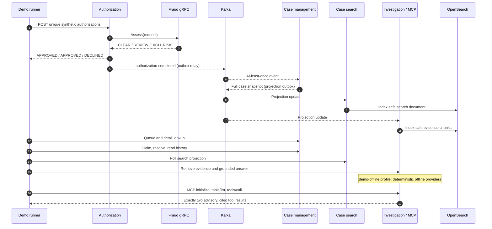

# End-to-end demo walkthrough

This is the recruiter/engineer map for the deterministic Cycle 8 demonstration. The primary entry
point is [`scripts/demo/run-demo.ps1`](../../scripts/demo/run-demo.ps1). It orchestrates existing
interfaces; it does not add a second business path, clear Docker volumes, or contact OpenAI.

## What the demo proves



The REVIEW outcome proves that a non-declining assessment can still create investigation work; its
case remains `NEW`. The demo follows the separate HIGH_RISK case through claim and resolution after
its blocking authorization outcome (`DECLINED/HIGH_FRAUD_RISK`). Neither case resolution nor an AI
answer can alter either completed authorization.

## Run and inspect

From the repository root, with Java 21 and Docker Desktop available:

```powershell
.\scripts\demo\run-demo.ps1
```

On Bash-capable hosts with PowerShell 7, `bash ./scripts/demo/run-demo.sh` is a thin launcher for the
same PowerShell implementation. Default local ports are fraud management `8081` (gRPC `9090`),
authorization `8082`, case management `8083`, case search `8084`, and investigation/MCP `8085`.
The corresponding `TRANSACTIQ_*_PORT` variables can override them; use one value consistently.

The runner waits with bounded polls rather than fixed sleeps and stops with a clear failing step
when infrastructure, a service, an event, or a projection is unavailable. Each run prints its
unique synthetic identifiers and a compact final checklist. Volumes remain in place, so a repeat
run creates new identifiers without destroying prior local state.

While it runs, the most useful code and documentation to inspect are:

1. `authorization-service`: HTTP mapping, idempotency claim, atomic completion, and outbox relay.
2. `fraud-engine` and `fraud-contract`: the unary Protobuf boundary, deterministic rules, safe
   token fingerprinting, and Redis-backed request/velocity state.
3. `event-contract` then `case-management-service`: versioned completed-event validation,
   persistent deduplication, DLT recovery, lifecycle invariants, and projection outbox.
4. `case-search-service`: alias-backed OpenSearch projection and cursor-bound query semantics.
5. `investigation-assistant-service`: safe evidence allowlist, hybrid retrieval, structured
   generation validation, demo-only provider isolation, REST endpoints, and MCP protocol tests.
6. `observability-support`, `.github/workflows`, and `infra`: bounded telemetry, build/deploy gates,
   and the non-applied GCP dev blueprint.

For details, use the [authorization lifecycle](../business/authorization-lifecycle.md),
[case model](../business/fraud-case-management.md),
[AI/MCP guide](../business/ai-investigation-assistant.md), and
[GCP blueprint](../operations/gcp-deployment-blueprint.md). The
[architecture-decision index](../architecture/README.md) explains why the main boundaries exist.

## Safe demo boundary

- Inputs use fresh UUIDs and unique synthetic card/merchant identifiers only.
- Before exercising the public workflow, the runner inserts three unique synthetic card-account
  fixtures directly into the local authorization database because no card-provisioning API exists.
  The subsequent authorization, case, search, investigation, and MCP steps use only existing
  service contracts.
- The offline AI implementation is available only under the explicit `demo-offline` profile. It
  provides deterministic embeddings and grounded fixtures without relaxing API-key, citation,
  integrity, DTO, or logging protections in the normal provider path.
- Request/response bodies, raw tokens, analyst questions, evidence, prompts, answers, credentials,
  and provider diagnostics are not printed or logged.
- The runner performs only supported case commands. AI REST and MCP calls remain read-only.
- Stopping the runner does not invoke `docker compose down -v` or remove named volumes.

## Troubleshooting

| Symptom | Check | Safe action |
|---|---|---|
| Docker prerequisite fails | `docker info` and `docker compose config --quiet` | Start Docker Desktop; do not delete volumes. |
| Java/Gradle prerequisite fails | `java -version` and `.\gradlew.bat --version` | Select a Java 21 runtime. |
| A local port is occupied | The failing startup output and the port owner | Stop the unrelated process, or use the documented environment override consistently. |
| Infrastructure never becomes ready | `docker compose ps` and the named container's recent logs | Correct that dependency and rerun; bounded polling will not hang forever. |
| Authorization fails before a decision | Fraud-engine readiness, PostgreSQL, Redis, and the stable sanitized error code | Restore the unavailable dependency; a technical error is not a fraud decline. |
| Case is not visible yet | Kafka readiness and case-management health | Allow the bounded event poll to finish; delivery is asynchronous and at-least-once. |
| Search/investigation lags | OpenSearch health and both projection consumers | Treat PostgreSQL case detail as authoritative; projections are eventually consistent. |
| AI tries to require a key | Confirm the runner selected the exact `demo-offline` profile | Do not set a fake key or enable provider logging; non-demo configurations intentionally fail closed. |
| MCP invocation fails | Investigation health and `/mcp` availability | Rerun after the service is ready; the demo initializes a real Streamable HTTP session. |
| Existing state changes expectations | Review the new run ID printed by the runner | Keep the generated ID; use a clean Compose project only when deliberately desired. Never remove volumes by default. |

For manual recovery rather than demo diagnosis, see the
[case-consumer runbook](../operations/case-management-kafka-recovery.md) and
[projection runbook](../operations/fraud-case-projection-recovery.md).
