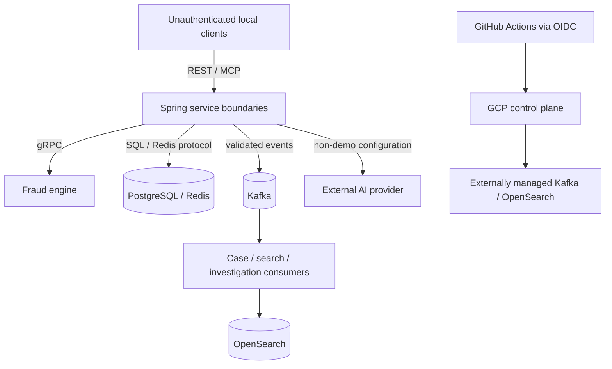

# Portfolio threat model

## Scope and assets

This review covers the local and GCP-blueprint paths from authorization ingress through fraud,
Kafka, case lifecycle, OpenSearch projections, investigation REST/MCP, and an optional AI provider.
The data is synthetic, but the design still protects authorization/case integrity, balance
reservations, idempotency identities, event bytes and hashes, rule evidence, analyst questions,
prompts and answers, provider/API credentials, projection integrity markers, and lifecycle audit
history.

It does not assert PCI compliance, production security, or deployment. The public portfolio has no
real cardholder, customer, employee, or merchant data.

## Trust boundaries

Every arrow crosses a boundary where input, identity, availability, or diagnostics must be treated
as untrusted. Local Compose plaintext and unauthenticated endpoints are development choices, not
production controls.

## Risks and current controls

| Threat | Current control | Residual risk / production action |
|---|---|---|
| Malformed, duplicated, reordered, or malicious Kafka data | Versioned Protobuf validation, exact-byte hashing, persistent identity constraints, monotonic projection checks, at-least-once-safe consumers, classified retry/DLT handling, and sanitized DLT metadata | Local Kafka is unauthenticated and single-node. Production needs provider ACLs, TLS, quotas, retention/backup policy, and lag/DLT operations. |
| Event/evidence text attempts prompt injection | Projection safe-field allowlist; evidence is delimited and treated as data; model output is structured then validated; unknown citations and uncited findings are rejected | A validly cited statement can still be misleading. Maintain adversarial evaluation, human review, and provider/model change control. |
| AI or search leaks private fields | Public DTOs omit raw tokens, vectors, hashes, private markers, identities, and provider payloads; investigation sources resolve to safe public metadata | Schema changes require allowlist review and regression tests. Production needs data-classification and retention governance. |
| Questions, prompts, answers, evidence, credentials, or provider diagnostics enter logs | Request bodies are not logged; DTO `toString()` methods are redacted; raw exceptions/provider bodies are replaced with stable errors; provider diagnostic logging is forced off | Infrastructure access logs and third-party telemetry need separate review before deployment. |
| Credential theft or accidental disclosure | Environment-backed configuration, fail-closed API-key checks, empty Secret Manager containers, secret-level runtime IAM, CI OIDC/WIF, no JSON service-account keys or Terraform-managed secret values | Operators must create/rotate secret versions and audit IAM outside this repository. Local demo credentials are synthetic only. |
| AI/MCP changes a case or presents autonomous decisions | Investigation ports are read-only; exactly two MCP tools delegate to retrieval/answer services; no claim/resolve/approve/block/assign capability exists; answers are advisory | Enforce the separation with authorization policy and service identity before exposing MCP remotely. |
| Unauthorized case claim/resolution | Optimistic versions, exact-assignee checks, idempotent retry rules, immutable history, and transactional updates | `X-Analyst-Id` is caller-supplied and forgeable. Add real authentication, authorization, actor audit, and gateway controls before production. |
| OpenSearch tampering, stale reads, or outage | PostgreSQL remains authoritative; projections validate identity/version; search and investigation return sanitized unavailable/incomplete responses; alias-based rebuild is documented | Current adapter lacks managed-service authentication. Add TLS trust/authentication, network policy, snapshots, capacity and availability objectives. |
| Availability abuse against public HTTP/MCP endpoints | Input bounds, page caps, opaque cursor validation, provider/RPC timeouts, bounded readiness/retry, and low-cardinality metrics | There is no rate limit, quota, bot protection, or authenticated tenant boundary. Do not expose these services publicly. |
| Cross-service or datastore overreach | Separate service databases, narrow application ports, dedicated GCP runtime service accounts, and secret-level IAM in the blueprint | Local Compose credentials are intentionally simple. Production DB roles and network/IAM policies remain operator prerequisites. |
| External Kafka/OpenSearch or cloud assumptions are misunderstood | Terraform models them as explicit external inputs and does not pretend to provision them; deploy defaults are disabled; plan and protected approval precede apply | Vendor selection, private connectivity, certificates, SLAs, backups, audit logs, and incident response are undecided. |

## Security invariants to preserve

- Fraud technical failures are never converted into `CLEAR`; AI/provider failures are never
  converted into grounded facts.
- A completed authorization cannot be changed by Kafka consumers, case lifecycle actions,
  OpenSearch, AI, or MCP.
- Case commands use PostgreSQL state and optimistic versions, never search/evidence projections.
- Raw card tokens never enter Kafka projections, Redis keys, logs, public case/search responses, or
  AI context. Local request bodies use only documented or uniquely generated synthetic fixtures.
- Evidence, analyst input, and generated content never become instructions or log fields.
- The `demo-offline` profile remains explicit and offline; non-demo provider configurations retain credential,
  citation, publication-integrity, error, and logging protections.
- CI validation does not deploy. Manual apply requires deliberately configured WIF variables, a
  reviewed Terraform plan, and protected-environment approval.

## Accepted risks before production

The following are transparent portfolio gaps, not deferred claims of safety:

1. Add authenticated human/workload identity, role- and case-scoped authorization, API gateway
   policy, rate limiting, and tamper-evident audit access. Replace `X-Analyst-Id` as identity.
2. Select and secure managed Kafka/OpenSearch with TLS, ACLs, private connectivity, credentials,
   backups, capacity tests, recovery objectives, lag/DLT alerts, and tested restoration.
3. Complete secrets rotation, least-privilege database roles, dependency/container scanning,
   artifact provenance, base-image digest policy, and environment-specific network controls.
4. Establish data classification, retention/deletion, privacy/legal review, AI-provider terms,
   model/evaluation change management, human oversight, and an incident-response process.
5. Define availability/SLOs, HA/DR, load and abuse testing, Cloud Run consumer suitability, and
   operational ownership. The existing k6 run is only a local smoke test.
6. Perform an independent security assessment before any real data, internet exposure, or
   production deployment. The current GCP design is an unapplied single-region dev blueprint.

## Review checklist

Before accepting a change, inspect the diff and repository for credentials, private keys, real or
sensitive demo data, Terraform state/plans, provider payload fixtures, build output, log statements
containing request/evidence fields, newly public DTO fields, and any new mutation path reachable
from AI or MCP. Validate links, tests, Compose configuration, and Terraform separately; none of
those checks substitutes for the production controls above.
